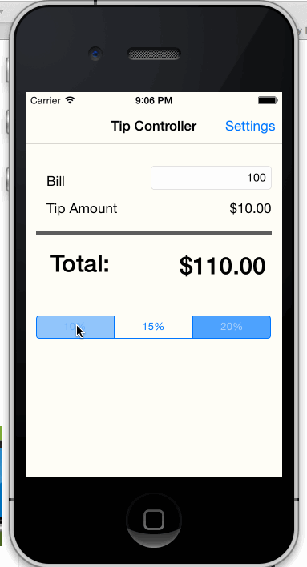

tipcalculator
=============

Intro to Ios programing exercise: implement a tip calculator
with a settings view

Hours to complete: 5

Completed user stories:
	Required: Implement a tip calculator
	Required: Add a settings page to set the default tip.

Walkthrough of all user Stories:

